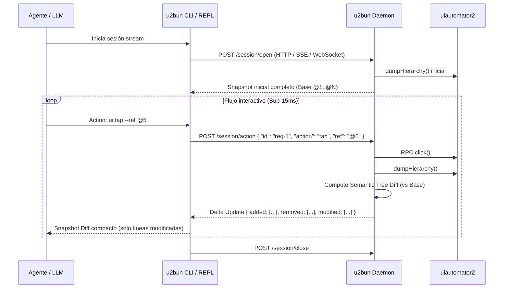

# Protocolo de Streaming y Diffs Semánticos en u2bun (RFC)

## 1. Motivación y Costos
En flujos interactivos de automatización móvil con LLMs (ej: "seguir página + dar like a 5 publicaciones + verificar"), el patrón tradicional CLI `request-response` genera:
- **15 invocaciones de proceso CLI:** 15 × (~50ms startup Bun + resolución de daemon).
- **15 re-transmisiones de snapshot completos:** ~15 × 2-3 KB de payload textual en cada paso.
- **Latencia acumulada:** ~7–10 segundos por flujo.

Con una **sesión stream persistente** (`--listen` o WebSocket/SSE / UNIX socket) y **diffs semánticos en el daemon**, la latencia total del flujo se reduce a **~1.5–2 segundos** y el payload transmitido cae de ~35KB a <2KB.

---

## 2. Arquitectura del Daemon Stream



---

## 3. Formato del Payload de Diff Semántico

### 3.1 Envelope de Diff (Machine/JSON)
```json
{
  "type": "diff",
  "base_fingerprint": "a1b2c3d4",
  "new_fingerprint": "e5f6a7b8",
  "patch": {
    "removed": ["@5", "@6"],
    "added": [
      { "ref": "@12", "role": "Button", "label": "Te gusta", "bounds": "[100,500][200,550]" }
    ],
    "modified": [
      { "ref": "@3", "changes": { "text": "3 comentarios" } }
    ]
  }
}
```

### 3.2 Representación Compacta para LLMs (Plain Text Diff)
Para consumo directo del modelo con mínimo consumo de tokens:

```text
[App: com.facebook.katana | diff: a1b2c3d4 -> e5f6a7b8]
- [@5] Button "Me gusta"
+ [@5] Button "Te gusta" [active]
~ [@3] Item "2 comentarios" -> "3 comentarios"
```

---

## 4. Algoritmo de Detección de Diffs en Memoria
El daemon almacena en memoria el árbol previo de `ActionElement[]` indexado por clave unívoca compuesta:
$$\text{NodeKey} = \text{className} + \text{resourceId} + \text{originalBounds}$$

1. **Nodos idénticos:** Si `NodeKey` y `text/contentDesc/focused/clickable` son iguales $\rightarrow$ No emitir.
2. **Nodos modificados:** Si `NodeKey` coincide pero cambia estado o texto $\rightarrow$ Emitir `~ [@N] Role "Old" -> "New"`.
3. **Nodos eliminados:** Presentes en Base pero ausentes en nuevo árbol $\rightarrow$ Emitir `- [@N] Role "Label"`.
4. **Nodos agregados:** Nuevos en el viewport tras scroll o transición $\rightarrow$ Asignar handle `@N+1` y emitir `+ [@M] Role "Label"`.

---

## 5. Próximos Pasos para Implementación
1. Endpoint `/session/stream` (Server-Sent Events) en `src/daemon/server.ts`.
2. Comando `u2bun stream` en CLI para agentes que operan en modo long-running.
3. Integración con `run steps` para ejecutar secuencias complejas consumiendo únicamente deltas.
