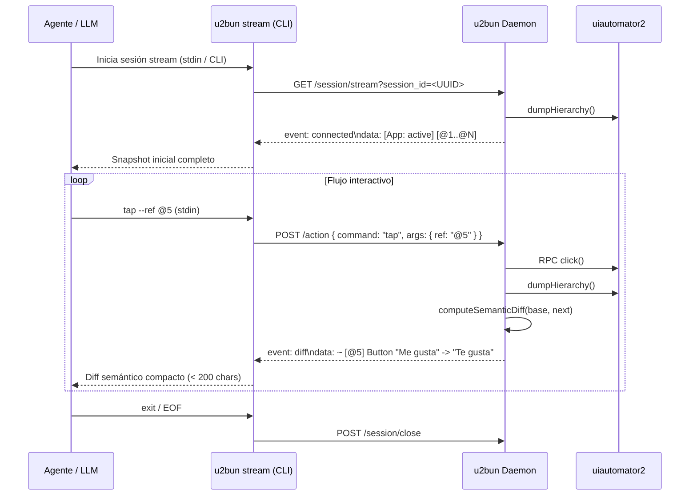

# Protocolo de Streaming y Diffs Semánticos en u2bun (Specification v1)

## 1. Motivación y Rendimiento

En flujos interactivos de automatización móvil con LLMs (ej: secuencias multi-paso de 10–20 acciones), el patrón tradicional CLI `request-response` genera:
- **Sobrecarga de procesos:** N invocaciones con cold startup y resolución de daemon.
- **Sobrecarga de contexto:** Re-transmisión de snapshots completos (~2-3 KB cada uno, 35–60 KB en total).
- **Consumo de tokens:** Pérdida de foco del LLM al recibir miles de líneas estáticas no modificadas.

Con una **sesión stream persistente** (`u2bun stream` via SSE) y **diffs semánticos en memoria**:
- **Payload reducido:** De ~35KB a **<2KB** por flujo multi-acción (<200 caracteres por diff estándar).
- **Eliminación de cold startup:** Sesión única viva por proceso.
- **Transparencia de device floor:** El costo de ADB (`dumpHierarchy` ~80–300ms) se preserva honestamente, optimizando la capa de transporte y contexto.

---

## 2. Arquitectura de Streaming (SSE + Action Dispatch)



---

## 3. Algoritmo de Detección de Diffs Semánticos

### 3.1 NodeKey Resistente a resourceId Vacío
Dado que ~40% de nodos Android carecen de `resourceId`, la clave estable utiliza:

$$\text{NodeKey} = \text{className} + "|" + \text{resourceId} + "|" + \text{label}_{0..32} + "|" + \text{boundsGrid}_{10\text{px}}$$

- `boundsGrid`: Las coordenadas `[x1, y1][x2, y2]` se normalizan con cuantización de 10px para absorber micro-variaciones de layout.
- `Tiebreaker`: En caso de colisiones en el mismo árbol, se aplica sufijo `#index`.

### 3.2 Categorización de Cambios
1. **Early Exit:** Si `baseFingerprint === nextFingerprint`, diff vacío (`[App: ... | unchanged]`) con 0 tokens de elementos.
2. **Modificados (`~`):** Elementos con misma clave o bounding box coincidente ($\ge 85\%$ overlap) que cambian `text`, `contentDesc`, `focused` o `clickable`.
3. **Eliminados (`-`):** Nodos presentes en Base ausentes en Next.
4. **Agregados (`+`):** Nodos nuevos en el viewport tras transición o scroll.

---

## 4. Formatos de Salida

### 4.1 Plain Text Compacto (LLM Token-Optimized)
```text
[App: com.facebook.katana | diff: a1b2c3d4 -> e5f6a7b8]
- [@4] Button "Compartir"
+ [@5] Button "Guardar"
~ [@3] Button "2 comentarios" -> "3 comentarios" [focused]
```

### 4.2 JSON Estructurado (`--json` o `?format=json`)
```json
{
  "type": "diff",
  "session_id": "sess_123",
  "base_fingerprint": "a1b2c3d4",
  "new_fingerprint": "e5f6a7b8",
  "added_count": 1,
  "removed_count": 1,
  "modified_count": 1,
  "added": [{ "ref": "@5", "role": "Button", "text": "Guardar", "bounds": "[700,700][1000,800]" }],
  "removed": [{ "ref": "@4", "role": "Button", "text": "Compartir" }],
  "modified": [{ "ref": "@3", "changes": { "text": "3 comentarios" } }]
}
```

---

## 5. Uso del Comando CLI `stream`

```bash
# Iniciar sesión de streaming interactiva
u2bun stream --serial emulator-5554

# Enviar comandos línea por línea por stdin:
tap --ref @5
scroll --direction down
type --ref @2 --text "hola"
snapshot
exit
```
